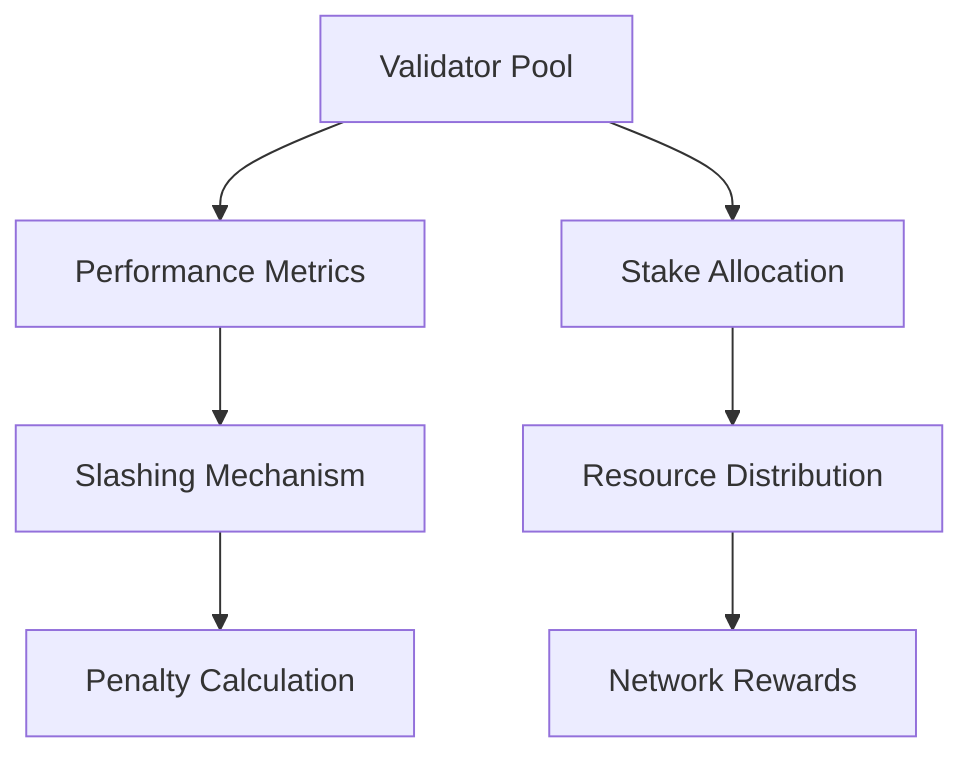

# SlashChain: Dynamic Stake Allocation

A decentralized stake slashing and resource allocation mechanism designed to enhance blockchain network security and performance.

## Overview

SlashChain provides a robust framework for dynamically managing validator stakes and network resources through automated, transparent governance mechanisms. By implementing sophisticated slashing and allocation strategies, the system promotes network integrity and efficient resource utilization.

## Key Features

- Stake-based validator performance tracking
- Automated slashing for malicious or underperforming validators
- Dynamic resource allocation based on network metrics
- Transparent and immutable governance rules
- Cryptographically secure reward and penalty mechanisms

## Architecture



## Smart Contract Capabilities

- Validator performance evaluation
- Automatic stake reduction for non-compliant actors
- Proportional resource allocation
- Transparent governance logging
- Deterministic penalty calculations

## Getting Started

### Prerequisites
- Clarinet
- Stacks wallet
- Node.js environment

### Installation

1. Clone the repository
2. Install dependencies
```bash
clarinet install
```
3. Run tests
```bash
clarinet test
```

## Core Functions

### Stake Management
```clarity
(evaluate-validator-performance 
  (validator principal)
  (performance-metrics (list uint)))
```

### Slashing Mechanism
```clarity
(apply-stake-penalty
  (validator principal)
  (penalty-percentage uint))
```

### Resource Allocation
```clarity
(distribute-network-resources
  (total-resources uint)
  (allocation-strategy (string-ascii 50)))
```

## Security Considerations

1. Performance Tracking
   - Comprehensive validator metric analysis
   - Multi-dimensional performance evaluation

2. Slashing Mechanisms
   - Proportional penalty calculation
   - Prevention of excessive or unfair punishments

3. Resource Allocation
   - Transparent distribution algorithms
   - Provably fair allocation strategies

4. Known Limitations
   - Requires ongoing parameter tuning
   - Dependent on accurate off-chain performance data

## Development

### Testing
```bash
clarinet test
```

### Local Development
```bash
clarinet integrate
clarinet deploy
```

## Contributing

Please read CONTRIBUTING.md for details on our code of conduct and the process for submitting pull requests.

## License

This project is licensed under the MIT License - see the LICENSE.md file for details.